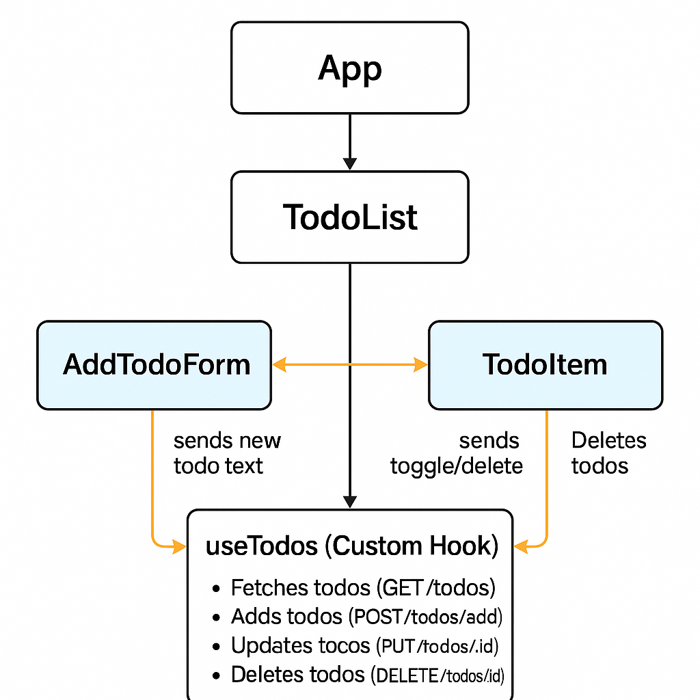

# 📝 React Todo List — Лабораторна робота №4  
**Автор:** Власенко Андрій  
**Група:** КН-311  
**GitHub:** [https://github.com/Sque1ze/lab-react.git](https://github.com/Sque1ze/lab-react.git)  
**Vercel:** [https://lab-react-beta.vercel.app/](https://lab-react-beta.vercel.app/)  

---

## 🎯 Мета роботи
Розробити вебзастосунок **Todo List** з використанням **React** та **кастомного хука `useTodos`**, який реалізує логіку CRUD-операцій через фейковий REST API **DummyJSON**.

---

## ⚙️ Використані технології
- **React 19 + Vite**
- **JavaScript (ES6+)**
- **CSS3 (Flexbox, сучасне оформлення)**
- **DummyJSON REST API**

---

## 📦 Структура проєкту
📁 src/
┣ 📁 components/
┃ ┣ 📄 AddTodoForm.jsx
┃ ┣ 📄 TodoItem.jsx
┃ ┗ 📄 TodoList.jsx
┣ 📁 hooks/
┃ ┗ 📄 useTodos.js
┣ 📁 assets/
┃ ┗ 📄 A_diagram_created_digitally_showcases_the_componen.png
┣ 📄 App.jsx
┣ 📄 main.jsx
┗ 📄 index.css

## 🧠 Компонентна структура та потік даних



### 🔍 Опис
1. **App.jsx** — головний компонент програми, що рендерить `<TodoList />`.  
2. **TodoList.jsx** — використовує кастомний хук `useTodos` і передає дані та колбеки дочірнім компонентам.  
3. **AddTodoForm.jsx** — містить форму для додавання нової задачі.  
4. **TodoItem.jsx** — відображає окрему задачу з можливістю видалення або позначення як виконаної.  
5. **useTodos.js** — обробляє логіку запитів до API:
   - `GET /todos` — отримання списку
   - `POST /todos/add` — додавання
   - `PUT /todos/:id` — оновлення статусу
   - `DELETE /todos/:id` — видалення

### 🔄 Потік даних
- ⬇️ **Пропси вниз:** від `TodoList` → до `TodoItem` та `AddTodoForm`  
- ⬆️ **Події вгору:** колбеки (onAdd, onToggle, onDelete) передаються назад у хук  
- 🔁 **useTodos** — центральна логіка управління станом і взаємодії з API  

---

## 🚀 Як запустити проєкт локально

```bash
# 1. Клонувати репозиторій
git clone https://github.com/Sque1ze/lab-react.git

# 2. Перейти в папку проєкту
cd lab-react

# 3. Встановити залежності
npm install

# 4. Запустити застосунок
npm run dev