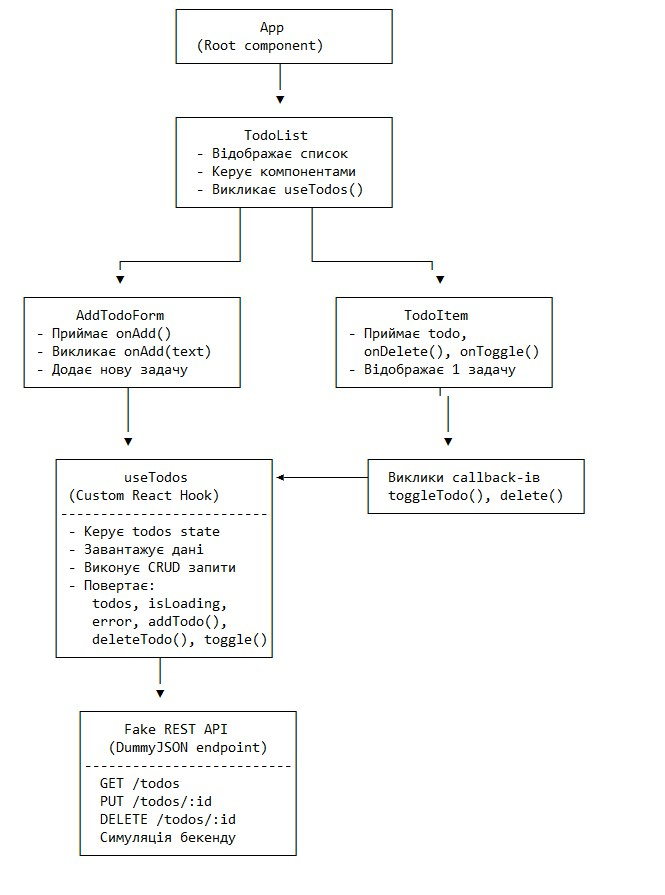

# 📝 React Todo List — Лабораторна робота №5-6
**Автор:** Власенко Андрій  
**Група:** КН-311  
**GitHub:** [https://github.com/Sque1ze/lab-react.git](https://github.com/Sque1ze/lab-react.git)  
**Vercel:** [https://lab-react-beta.vercel.app/](https://lab-react-beta.vercel.app/)  

---

## 🎯 Мета роботи
Розробити вебзастосунок **Todo List** з використанням **React** та **кастомного хука `useTodos`**, який реалізує логіку CRUD-операцій через фейковий REST API **DummyJSON**.

---

## ⚙️ Використані технології
- **React 19 + Vite**
- **JavaScript (ES6+)**
- **CSS3 (Flexbox, сучасне оформлення)**
- **DummyJSON REST API**

---

## 📦 Структура проєкту
📁 src/
┣ 📁 components/
┃ ┣ 📄 AddTodoForm.jsx
┃ ┣ 📄 TodoItem.jsx
┃ ┗ 📄 TodoList.jsx
┣ 📁 hooks/
┃ ┗ 📄 useTodos.js
┣ 📁 assets/
┃ ┗ 📄 A_diagram_created_digitally_showcases_the_componen.png
┣ 📄 App.jsx
┣ 📄 main.jsx
┗ 📄 index.css

## 🧠 Компонентна структура та потік даних



### 🔍 Опис
🔹 App (Root component)
Є кореневим компонентом усього застосунку.
Не містить власного стану (state) і не приймає властивостей (props).
Відповідає за рендеринг головного компонента TodoList.

🔹 TodoList
Основний компонент, який:
Відображає список завдань;
Керує підкомпонентами (AddTodoForm, TodoItem);
Викликає користувацький хук useTodos() для керування даними.
Не має власного state, усі дані отримує через хук.

🔹 AddTodoForm
Приймає через props функцію onAdd(text), яка викликається при додаванні нового завдання.
Не має власного стану (state).
Відповідає за обробку введеного тексту та створення нового елемента у списку.

🔹 TodoItem
Приймає через props:
todo — об’єкт завдання;
onDelete() — функцію для видалення;
onToggle() — функцію для перемикання стану виконання.
Не має власного state.
Відображає одну задачу та реагує на дії користувача (виконує callback-и toggleTodo() і delete()).

🔹 useTodos (Custom React Hook)
Це спеціальний хук, який керує логікою роботи із завданнями.
Містить власний state:
todos — список завдань;
isLoading — стан завантаження;
error — повідомлення про помилки.
Не приймає props.
Виконує CRUD-запити до API, завантажує дані та повертає функції:
addTodo(), deleteTodo(), toggleTodo().

🔹 Fake REST API (DummyJSON)
Симулює бекенд-сервер для взаємодії з даними.
Підтримує методи:
GET /todos — отримання списку завдань;
PUT /todos/:id — оновлення завдання;
DELETE /todos/:id — видалення завдання.
Забезпечує тестову роботу додатку без реального серверного середовища.

### 🔄 Потік даних
- ⬇️ **Пропси вниз:** від `TodoList` → до `TodoItem` та `AddTodoForm`  
- ⬆️ **Події вгору:** колбеки (onAdd, onToggle, onDelete) передаються назад у хук  
- 🔁 **useTodos** — центральна логіка управління станом і взаємодії з API  

---

## 🚀 Як запустити проєкт локально

```bash
# 1. Клонувати репозиторій
git clone https://github.com/Sque1ze/lab-react.git

# 2. Перейти в папку проєкту
cd lab-react

# 3. Встановити залежності
npm install

# 4. Запустити застосунок
npm run dev
